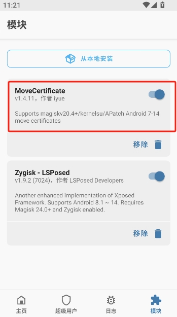
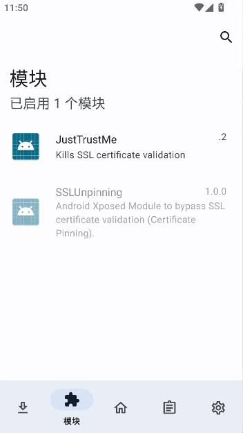

# Mitm-All
一个致力于实现多协议中间人攻击的工具

- 已实现HTTP、SOCKS5代理协议端口复用
- 已实现TCP、HTTP、TLS中间人攻击功能

## 前言

### 安卓APP渗透抓不到包的常见原因

1. 没有正确地将CA证书安装到/system/etc/security/cacerts（即没有将中间人CA证书安装到操作系统证书受信任根目录）
2. 应用设置了SSL Pinning（即只信任应用包下的特定证书）
3. 应用设置了NO_PROXY（即应用不走系统代理）或自行设置了应用层级的代理

### 解决安卓APP渗透抓包困境的办法

#### 安装证书到收信人CA目录

##### 方法一：直接安装（适合UserDebug版本的系统）

- 先使用[remount_to_system.bat](https://github.com/vpxuser/Awesome-Script/blob/main/remount_to_system.bat)脚本重新挂载硬盘到系统盘
  - d：安卓设备ID（DeviceID），通过`adb devices`命令可以获取
  - f：重启参数，可选，有些设备需要禁用安卓固件验证才能挂载成功

```cmd
.\remount_to_system.bat -d [安卓设备ID] -f
```

- 再使用[upload_ca_cert.bat](https://github.com/vpxuser/Awesome-Script/blob/main/upload_ca_cert.bat)脚本上传CA证书到安卓设备
  - d：安卓设备ID（DeviceID），通过`adb devices`命令可以获取
  - c：CA证书文件所在的物理路径
  

```cmd
.\upload_ca_cert.bat -d [安卓设备ID] -c [证书文件路径]
```

##### 方法二：使用面具模块载入（适合真机）

- 使用[MoveCertificate](https://github.com/ys1231/MoveCertificate)模块将用户证书目录的证书移动到系统证书目录



##### 方法三：使用frida动态注入（适合没有内存动态防护的应用）

- 使用[inject_ca_certificate.js](https://github.com/vpxuser/Awesome-Script/blob/main/inject_ca_certificate.js)脚本将证书注入到安卓APP，脚本运行前，请自行将证书文件名修改为ca.crt或打开脚本修改证书路径

```cmd
frida -U -f [APK包名] -l [脚本文件路径]
```

#### 取消证书锁定

##### 方法一：使用frida动态注入（适合没有内存动态防护的应用）

- 使用[bypass_ssl_pinning.js](https://github.com/vpxuser/Awesome-Script/blob/main/bypass_ssl_pinning.js)脚本解除证书锁定

```cmd
frida -U -f [APK包名] -l [脚本文件路径]
```

##### 方法二：使用面具模块载入（适合真机）

- 使用[JustTrustMe](https://github.com/Fuzion24/JustTrustMe)模块解除证书锁定



#### 使用强制代理

##### 方法一：使用具有透明代理功能的代理应用

- 使用[Mitm-All](https://github.com/vpxuser/Mitm-All)配合透明代理工具强抓TCP流量，如：[Proxifier](https://www.proxifier.com/download/#android-tab)

```cmd
.\mitmall.exe
```

##### 方法二：使用frida动态注入（适合没有内存动态防护的应用）

- 使用[force_use_proxy.js](https://github.com/vpxuser/Awesome-Script/blob/main/force_use_proxy.js)脚本让安卓APP强制走代理，代理地址默认为127.0.0.1:8080，如有需求请打开脚本修改默认配置

```cmd
frida -U -f [APK包名] -l [脚本文件路径]
```

##### 方法三：系统命令设置iptables

- 使用[set_iptables_proxy.bat](https://github.com/vpxuser/Awesome-Script/blob/main/set_iptables_proxy.bat)脚本设置透明代理

```cmd
.\set_iptables_proxy.bat set -d [安卓设备ID] -h [代理服务器IP] -p [代理服务器端口]
```

## 编译

- 编译linux可执行文件

```cmd
set GOOS=linux
set GOARCH=amd64
go build -o mitmall main.go
```

- 编译windows可执行文件

```cmd
set GOOS=windows
set GOARCH=amd64
go build -o mitmall.exe main.go
```

- 编译macOS可执行文件

```cmd
set GOOS=darwin
set GOARCH=amd64
go build -o mitmall main.go
```

## 配置

- 在可执行程序目录下创建一个config文件夹，在config文件夹下创建一个config.yml文件，config.yml文件配置参考

```yaml
log:
  # 日志颜色开关，默认开启
  colorSwitch: true
  # 日志等级，5为开启debug日志，4为普通日志
  level: 4
mitm:
  # socks5服务监听地址，默认监听本地1080端口
  host: 0.0.0.0:1080
  # 工具线程数，默认最大
  threads: 0
  # 超时设置
  timeout:
    # 是否设置连接超时，默认不启用超时设置
    switch: false
    # 超时时间，默认60s
    client: 60s
    target: 60s
  # socks5服务的DNS解析开关，默认关闭
  bound: false
  # 是否开启TCP中间人攻击的开关，默认开启（注意：关闭后就只是一个单纯的socks5代理服务）
  switch: true
  # 打印TCP流到控制台（对于无法识别的协议，即：HTTP、HTTPS之外的协议）
  dump:
    # 默认关闭
    switch: false
    # 要跟踪打印目标服务的端口（假设目标服务8000端口开放了一个IM服务，可以根据目标服务端口打印TCP流信息）
    port: 8000
tls:
  # 是否开启TLS中间人攻击，默认开启
  mitmSwitch: true
  # 是否开启Finished握手消息校验，默认关闭
  verifyFinished: false
  # 是否开启TLS记录MAC校验，默认关闭
  verifyMAC: false
  # 默认SNI，如果ClientHello没有SNI扩展时，工具会通过默认SNI来获取服务器证书，这里必须配置！！！
  defaultSNI: okii.com
http:
  # HTTP中间人攻击开关，默认开启
  mitmSwitch: true
  # HTTP上游代理设置，会把HTTP和HTTPS数据包转发到上游代理服务器，为空则不走代理
  proxy: http://127.0.0.1:8080
# DNS服务器设置，用于查询域名对应的CDN IP，并将解析记录存储到缓存，方便后续TLS握手进行IP反查域名获取证书
dns: 114.114.114.114
ca:
  # CA证书颁发机构的域名，可以通过设置这个来伪造一个CA证书并保存到配置文件夹
  domain: www.digicert.com
  # CA证书路径
  cert: config/ca/ca.crt
  # CA私钥路径
  key: config/ca/ca.key
db:
  cache:
    # sqlite缓存模式debug日志开关
    logSwitch: false
  main:
    # sqlite持久化模式debug日志开关
    logSwitch: false
    # sqlite数据库路径
    path: config/sqlite/main.db
```

## 运行

- 打开命令行，并进入可执行程序所在目录，运行可执行程序

```powershell
.\mitmall.exe
```

## 代理

- 使用SOCKS5代理客户端配置代理，这里使用Proxifier做演示


- 安装抓包工具证书到移动设备或模拟器（注意：需要ROOT权限），这里使用BurpSuite
- 在config.yml文件配置下游代理为BurpSuite代理地址（这里使用BurpSuite默认地址http://127.0.0.1:8080）
- BurpSuite通过上游代理获取到HTTP报文，抓包成功


## 其他

如有疑问，请在Issues提出
