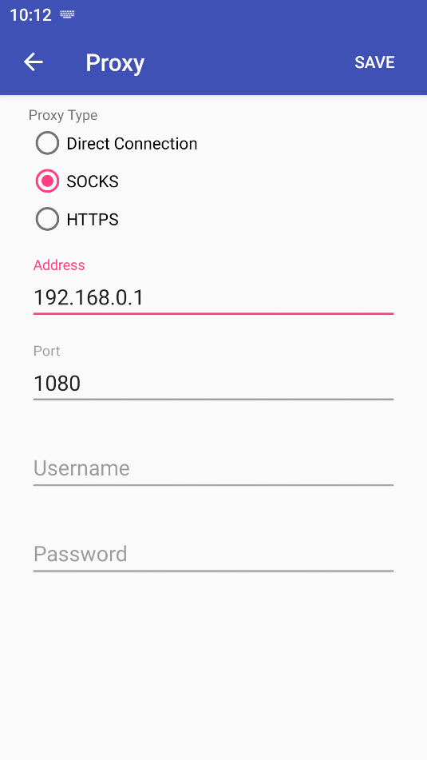
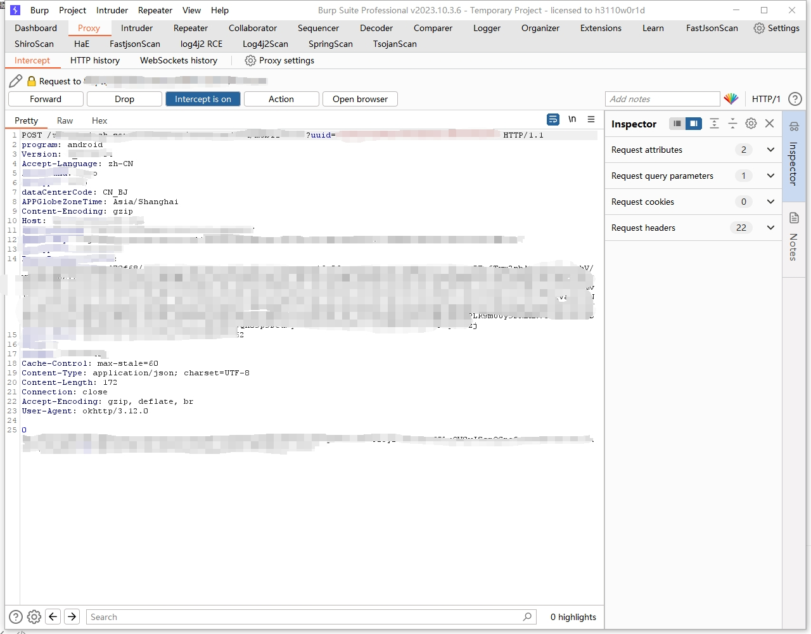

# socks2https
A tool that converts the SOCKS5 protocol to HTTP and HTTPS protocols

一个将socks5协议转化为http和https协议的工具

## 抓不到包的常见原因

1. 没有正确地将CA证书安装到/system/etc/security/cacerts（即没有将中间人CA证书安装到操作系统证书受信任根目录）
2. 应用设置了SSL Pinning（即只信任应用包下的特定证书）
3. 应用设置了NO_PROXY（即应用不走系统代理）或自行设置了应用层级的代理

## 解决抓包困境的办法

### 安装证书到/system/etc/security/cacerts目录

#### 方法一：直接安装（适合UserDebug版本的系统）

- 先使用remount.bat脚本重新挂载硬盘到系统盘
  - 安卓设备ID：DeviceID，通过`adb devices`命令可以获取
  - wait：重启参数，可选，有些设备需要重启才能挂载成功

```shell
.\remount.bat [安卓设备ID] [wait]
```

- 使用push.bat脚本上传CA证书到安卓设备
  - 证书文件路径：CA证书文件所在的物理路径

```shell
.\push.bat [证书文件路径] [安卓设备ID]
```

#### 方法二：使用面具模块载入（适合真机）

#### 方法三：使用frida动态注入（适合没有内存动态防护的应用）

### 取消证书锁定SSL Unpinning

#### 方法一：使用frida动态注入（适合没有内存动态防护的应用）

#### 方法二：使用面具模块载入（适合真机）

### 使用透明代理（iptables）

#### 方法一：使用具有透明代理功能的代理应用

- 如：Proxifier

#### 方法二：使用frida动态注入（适合没有内存动态防护的应用）

#### 方法三：系统命令设置iptables

## 目的

在针对APP渗透测试过程中，会发现某些APP不走系统代理，排查过后发现并不是SSL Pinning的问题，针对这种情况，如何强制抓去不走系统代理的数据包呢？

- 相信使用过Proxifier的朋友都知道，Proxifier能强制使所有协议都走Socks5代理，那么现在需要一个工具，将Proxifier转发的流量转换为HTTP和HTTPS，这样，不走系统代理的数据包也能被我们抓取到了。
- 其实，Socks5中间人攻击目前也有解决方案，比如说：Yakit、Charles等，但是个人使用体验并不好（原因：Yakit的UI太复杂、Charles没有强大的插件生态支持），所以就开发了这个工具，通过这个工具联动Burp Suite，就能让Burp Suite实现Socks5中间人攻击。

## 使用方法

### 编译

- 编译linux可执行文件

```powershell
set GOOS=linux
set GOARCH=amd64
go build -o socks2https main.go
```

- 编译windows可执行文件

```powershell
set GOOS=windows
set GOARCH=amd64
go build -o socks2https.exe main.go
```

- 编译macOS可执行文件

```powershell
set GOOS=darwin
set GOARCH=amd64
go build -o socks2https main.go
```

### 配置

- 在可执行程序目录下创建一个config文件夹
- 在config文件夹下创建一个config.yml文件，config.yml文件配置参考

```yaml
log:
  # 日志颜色开关，默认开启
  colorSwitch: true
  # 日志等级，5为开启debug日志，4为普通日志
  level: 4
socks:
  # socks5服务监听地址，默认监听本地1080端口
  host: 0.0.0.0:1080
  # 工具线程数，默认最大
  threads: 0
  # 超时设置
  timeout:
    # 是否设置连接超时，默认不启用超时设置
    switch: false
    # 超时时间，默认60s
    client: 60s
    target: 60s
  # socks5服务的DNS解析开关，默认关闭
  bound: false
  # 是否开启TCP中间人攻击的开关，默认开启（注意：关闭后就只是一个单纯的socks5代理服务）
  mitmSwitch: true
  # 打印TCP流到控制台（对于无法识别的协议，即：HTTP、HTTPS之外的协议）
  dump:
    # 默认关闭
    switch: false
    # 要跟踪打印目标服务的端口（假设目标服务8000端口开放了一个IM服务，可以根据目标服务端口打印TCP流信息）
    port: 8000
tls:
  # 是否开启TLS中间人攻击，默认开启
  mitmSwitch: true
  # 是否开启Finished握手消息校验，默认关闭
  verifyFinished: false
  # 是否开启TLS记录MAC校验，默认关闭
  verifyMAC: false
  # 默认SNI，如果ClientHello没有SNI扩展时，工具会通过默认SNI来获取服务器证书，这里必须配置！！！
  defaultSNI: baidu.com
http:
  # HTTP中间人攻击开关，默认开启
  mitmSwitch: true
  # HTTP上游代理设置，会把HTTP和HTTPS数据包转发到上游代理服务器，为空则不走代理
  proxy: http://127.0.0.1:8080
# DNS服务器设置，用于查询域名对应的CDN IP，并将解析记录存储到缓存，方便后续TLS握手进行IP反查域名获取证书
dns: 114.114.114.114
ca:
  # CA证书颁发机构的域名，可以通过设置这个来伪造一个CA证书并保存到配置文件夹
  domain: www.digicert.com
  # CA证书路径
  cert: config/ca/ca.crt
  # CA私钥路径
  key: config/ca/ca.key
db:
  cache:
    # sqlite缓存模式debug日志开关
    logSwitch: false
  main:
    # sqlite持久化模式debug日志开关
    logSwitch: false
    # sqlite数据库路径
    path: config/sqlite/main.db
```

### 运行

- 打开命令行，并进入可执行程序所在目录
- 运行可执行程序

```powershell
.\socks2https.exe
```

### 代理

- 使用socks5代理客户端配置代理，这里使用proxifier做演示



- 安装抓包工具证书到移动设备或模拟器（注意：需要root权限），这里使用burpsuite
- 在config.yml文件配置下游代理为burpsuite代理地址（这里使用burpsuite默认地址http://127.0.0.1:8080）
- 抓包



## 其他

如有疑问，请在Issues提出
